# RESULTS

> **Generated by `src/07_report.py` from the latest pipeline run. Do not edit by hand.**
> Data: Building Data Genome Project 2 (BDG2), a **public dataset** of real hourly meter readings; electricity only, calendar year 2017. This is an analysis of public data, not a deployed system. Tariff, emission factor, opening hours and savings scenarios are **assumptions** (listed at the end). Buildings are in the USA and Ireland; the Indian emission factor and INR tariff are applied for **demonstration only**.

## Headline findings

1. **Data quality:** validating 92 candidate buildings (11 Retail + 81 Office) for 2017 flagged 1.78% of 805,920 hourly readings as invalid (12,282 missing values, 1,308 zero readings, 730 flatline hours, 1 spike). 10 buildings failed (5 eui_implausible, 5 pct_valid<95.0); 25 were kept (9 Retail, 16 Office).
2. **EUI spread:** electricity EUI runs from 51 to 418 kWh/m²/yr across the 9 Retail buildings (median 147) and from 45 to 240 across the 16 offices (median 143). The gap between the best and worst quartile (P75 − P25) is 161 kWh/m²/yr for Retail and 81 for Office.
3. **After-hours use:** offices use 49%–68% of their electricity outside the assumed 08:00–18:00 weekday hours (which cover 30% of the week). After-hours load above each building's own baseload adds up to 2,342,873 kWh/yr (11.1% of portfolio use): an upper bound, worth ₹1.87 crore (INR 18,742,985) at the assumed ₹8.00/kWh.
4. **Anomalies:** the MAD baseline flagged 906 building-days (266 high severity) and Isolation Forest 599. They agree on only 155 building-days (Jaccard 0.115). With no ground truth, that is disagreement to investigate, not an accuracy score.
5. **Carbon and benchmark gap:** with the CEA India factor (0.675 tCO2/MWh, applied for demonstration only) the portfolio's 21,101,830 kWh/yr equals 14,244 tCO2. Bringing the 7 worst-quartile buildings to their type's median EUI would avoid 3,761,700 kWh/yr (17.8% of portfolio use, 2,539 tCO2). That is a benchmark gap, not a forecast.

## 1. Building selection

- BDG2 labels only 11 buildings with an electricity meter as `Retail`, below the 15-building minimum, so **offices were added** as the closest commercial type, taken only from the sites that also hold Retail buildings (Fox, Panther, Rat, Wolf) so that climate and weather are shared.
- Analysis year chosen from the data: median share of valid hours for the Retail candidates was 78.12% in 2016, 99.87% in 2017, so **2017** was used (several Panther Retail meters read zero for much of 2016).
- Criteria, in config.yaml: known floor area (sqm and sqft must agree), ≥ 95.0% valid hours, ≤ 2.0% of hours interpolated, and a plausible annualised EUI (25–1000 kWh/m²/yr).
- All Retail buildings that passed were kept; offices were sampled at random (seed 42) from those that passed, 4 per site. Result: **25 buildings (9 Retail, 16 Office)**.
- In the data and documents they are called **buildings**. They are not IKEA stores or any retailer's stores.

Buildings that failed validation:

| building_id | building_type | pct_valid | eui_annualised | fail_reasons |
|---|---|---:|---:|---|
| Panther_retail_Gilbert | Retail | 99.87 | 4.3 | eui_implausible |
| Panther_retail_Rachel | Retail | 99.86 | 1174.6 | eui_implausible |
| Fox_office_Bernard | Office | 93.57 | 269.2 | pct_valid<95.0 |
| Fox_office_Clayton | Office | 99.99 | 1560.4 | eui_implausible |
| Fox_office_Essie | Office | 99.95 | 12.7 | eui_implausible |
| Panther_office_Brent | Office | 94.38 | 110.4 | pct_valid<95.0 |
| Panther_office_Christin | Office | 92.27 | 30.0 | pct_valid<95.0 |
| Panther_office_Lois | Office | 99.86 | 1102.4 | eui_implausible |
| Rat_office_Ashlee | Office | 24.37 | 53.9 | pct_valid<95.0 |
| Rat_office_Chris | Office | 64.65 | 132.6 | pct_valid<95.0 |

## 2. Data quality

Every check ran on all 92 candidates (full table: `data/processed/data_quality_report.csv`). Each invalid reading is counted under the first check that caught it.

| check | all 92 candidates (hours) | 25 selected (hours) |
|---|---:|---:|
| missing timestamps | 0 | 0 |
| duplicate timestamps | 0 | 0 |
| missing values | 12282 | 491 |
| negative readings | 0 | 0 |
| zero readings (treated as dropout) | 1308 | 267 |
| spikes (> 3 x own P99) | 1 | 0 |
| flatlines (same value ≥ 24 h) | 730 | 78 |
| total invalid | 14321 | 836 |
| filled (gaps ≤ 3 h, flagged) | 341 | 112 |
| excluded (longer gaps) | 13980 | 724 |

- Selected buildings: 836 of 219,000 hours invalid (0.38%); 112 filled and flagged, 724 excluded. Lowest valid shares: Wolf_retail_Harriett 97.47%, Rat_office_Jill 97.51%, Fox_retail_Manie 99.02%.
- The most frequently filled hour is **2017-03-12 02:00** (13 buildings). This is the US daylight-saving 'spring forward' hour: that local hour does not exist, so US meters have no reading for it. It is interpolated and flagged like any other 1-hour gap.
- **Metadata issue:** site Wolf has longitude +6.26 but timezone Europe/Dublin (west of Greenwich), so the sign is probably flipped. Reported, not changed: `dim_building` keeps the source value, so do not use a map visual for these buildings without correcting it.
- Excluded hours are not guessed. Annual kWh is scaled up to the full year (`kwh_annualised` = measured kWh × hours in year / valid hours) so gaps do not make a building look efficient.
- Weather: Fox 0 missing hours (0 filled); Panther 0 missing hours (0 filled); Rat 3 missing hours (3 filled); Wolf 10 missing hours (10 filled).

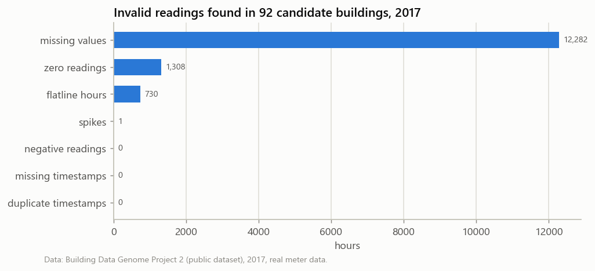

## 3. KPIs and benchmarking

- Portfolio: **21,101,830 kWh/yr** (annualised) over 130,575 m², portfolio EUI **161.6 kWh/m²/yr**, **14,244 tCO2/yr** at 0.675 tCO2/MWh (CEA India factor; demonstration only).
- Retail EUI: min 51, P25 95, median 147, P75 255, max 418 kWh/m²/yr.
- Office EUI: min 45, P25 103, median 143, P75 184, max 240 kWh/m²/yr.
- `after_hours_share` is the share of ENERGY used outside the assumed opening hours; `after_hours_time_share` is the share of HOURS that are outside them. A building with a flat load has the two equal, so compare them, not the first one alone.
- `weekend_weekday_ratio` = average weekend day kWh / average weekday kWh. It tests the opening-hours assumption: Panther_retail_Kristina (0.57), Wolf_retail_Toshia (0.67) use much less at weekends although Retail is assumed open 7 days, so their after-hours figures are understated.
- EUI here is **electricity only**. Buildings heated by gas, steam or district systems will look better than they are, and climates differ between sites (by metadata coordinates and timezones: Panther = Orlando FL area, Fox = Phoenix AZ area, Rat = Washington DC, Wolf = Dublin), so peer ranks are indicative.

| building_id | building_type | floor_area_m2 | kwh_annualised | eui_kwh_m2 | eui_rank_in_type | eui_percentile_in_type | load_factor | after_hours_share | after_hours_time_share | weekend_weekday_ratio | co2_tonnes |
|---|---|---|---|---:|---:|---:|---:|---|---|---:|---:|
| Wolf_office_Rochelle | Office | 3,115 | 139,940 | 44.9 | 1 | 0 | 0.35 | 54% | 70% | 0.7 | 94 |
| Panther_office_Kristen | Office | 8,720 | 405,772 | 46.5 | 2 | 7 | 0.5 | 68% | 70% | 0.89 | 274 |
| Wolf_office_Darleen | Office | 5,036 | 365,682 | 72.6 | 3 | 13 | 0.51 | 56% | 70% | 0.76 | 247 |
| Fox_office_Molly | Office | 576 | 59,165 | 102.7 | 4 | 20 | 0.19 | 52% | 70% | 0.58 | 40 |
| Fox_office_Rowena | Office | 3,132 | 322,751 | 103.0 | 5 | 27 | 0.45 | 60% | 70% | 0.76 | 218 |
| Fox_office_Berniece | Office | 2,173 | 275,551 | 126.8 | 6 | 33 | 0.37 | 65% | 70% | 0.7 | 186 |
| Panther_office_Clementine | Office | 3,100 | 407,497 | 131.4 | 7 | 40 | 0.5 | 64% | 70% | 0.85 | 275 |
| Rat_office_Arron | Office | 3,716 | 512,445 | 137.9 | 8 | 47 | 0.43 | 60% | 70% | 0.75 | 346 |
| Panther_office_Catherine | Office | 2,504 | 368,610 | 147.2 | 9 | 53 | 0.32 | 63% | 70% | 0.89 | 249 |
| Rat_office_Jill | Office | 31,587 | 5,118,595 | 162.0 | 10 | 60 | 0.3 | 49% | 70% | 0.49 | 3455 |
| Rat_office_Loyd | Office | 2,779 | 466,715 | 167.9 | 11 | 67 | 0.45 | 57% | 70% | 0.74 | 315 |
| Wolf_office_Cary | Office | 11,795 | 2,117,811 | 179.6 | 12 | 73 | 0.58 | 60% | 70% | 0.84 | 1430 |
| Rat_office_Olivia | Office | 2,564 | 501,405 | 195.5 | 13 | 80 | 0.42 | 53% | 70% | 0.6 | 338 |
| Fox_office_Joy | Office | 6,581 | 1,531,439 | 232.7 | 14 | 87 | 0.59 | 64% | 70% | 0.87 | 1034 |
| Wolf_office_Nadia | Office | 2,745 | 657,785 | 239.6 | 15 | 93 | 0.46 | 61% | 70% | 0.83 | 444 |
| Panther_office_Larry | Office | 1,739 | 417,144 | 239.9 | 16 | 100 | 0.49 | 58% | 70% | 0.79 | 282 |
| Panther_retail_Kristina | Retail | 5,488 | 282,268 | 51.4 | 1 | 0 | 0.4 | 38% | 50% | 0.57 | 191 |
| Panther_retail_Lester | Retail | 840 | 58,875 | 70.1 | 2 | 12 | 0.27 | 35% | 50% | 0.9 | 40 |
| Wolf_retail_Harriett | Retail | 4,108 | 388,382 | 94.5 | 3 | 25 | 0.34 | 40% | 50% | 0.84 | 262 |
| Fox_retail_Manie | Retail | 4,201 | 562,296 | 133.8 | 4 | 38 | 0.54 | 37% | 50% | 0.78 | 380 |
| Wolf_retail_Toshia | Retail | 4,209 | 618,756 | 147.0 | 5 | 50 | 0.35 | 34% | 50% | 0.67 | 418 |
| Wolf_retail_Marcella | Retail | 363 | 59,168 | 163.0 | 6 | 62 | 0.33 | 43% | 50% | 0.76 | 40 |
| Panther_retail_Romeo | Retail | 15,028 | 3,833,752 | 255.1 | 7 | 75 | 0.72 | 47% | 50% | 0.9 | 2588 |
| Panther_retail_Felix | Retail | 2,942 | 989,491 | 336.3 | 8 | 88 | 0.51 | 36% | 50% | 0.88 | 668 |
| Rat_retail_Jeffrey | Retail | 1,533 | 640,534 | 417.9 | 9 | 100 | 0.39 | 41% | 50% | 1.01 | 432 |

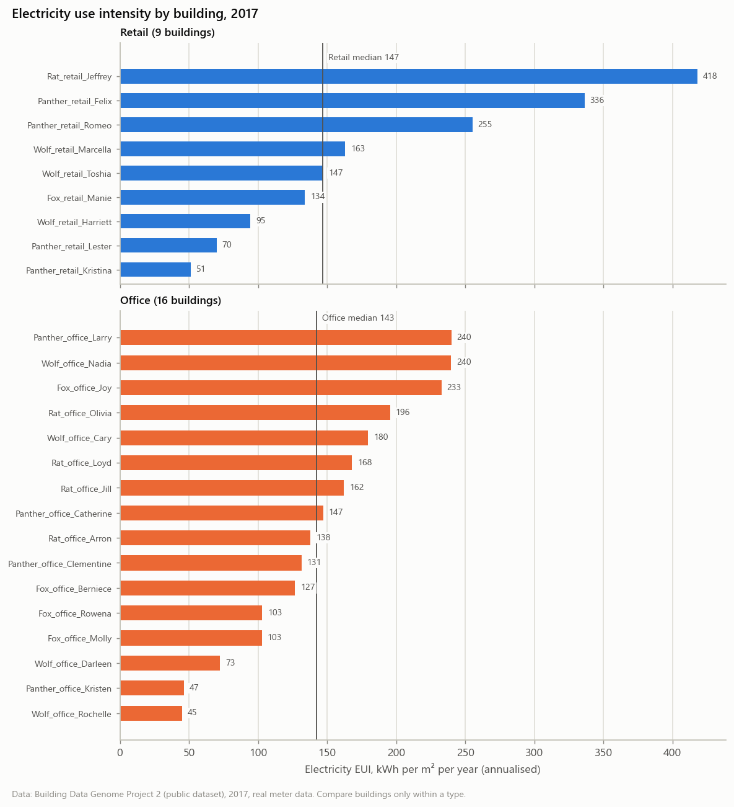

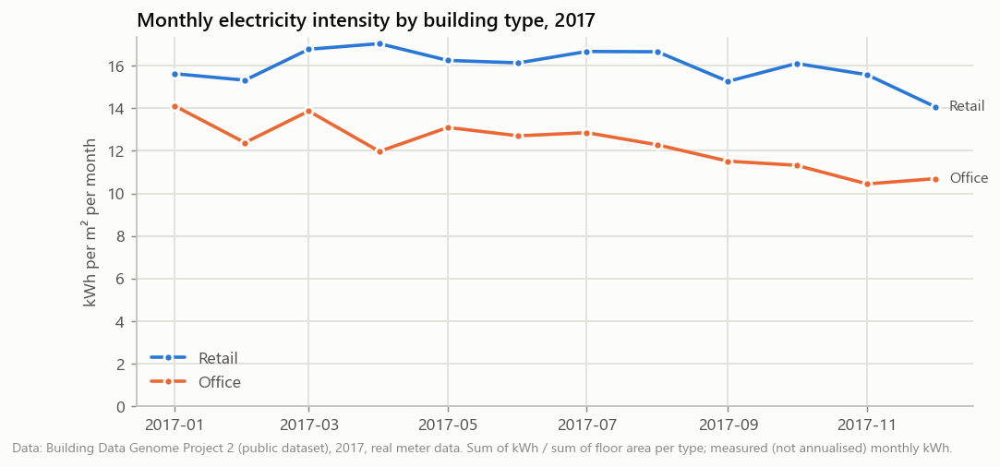

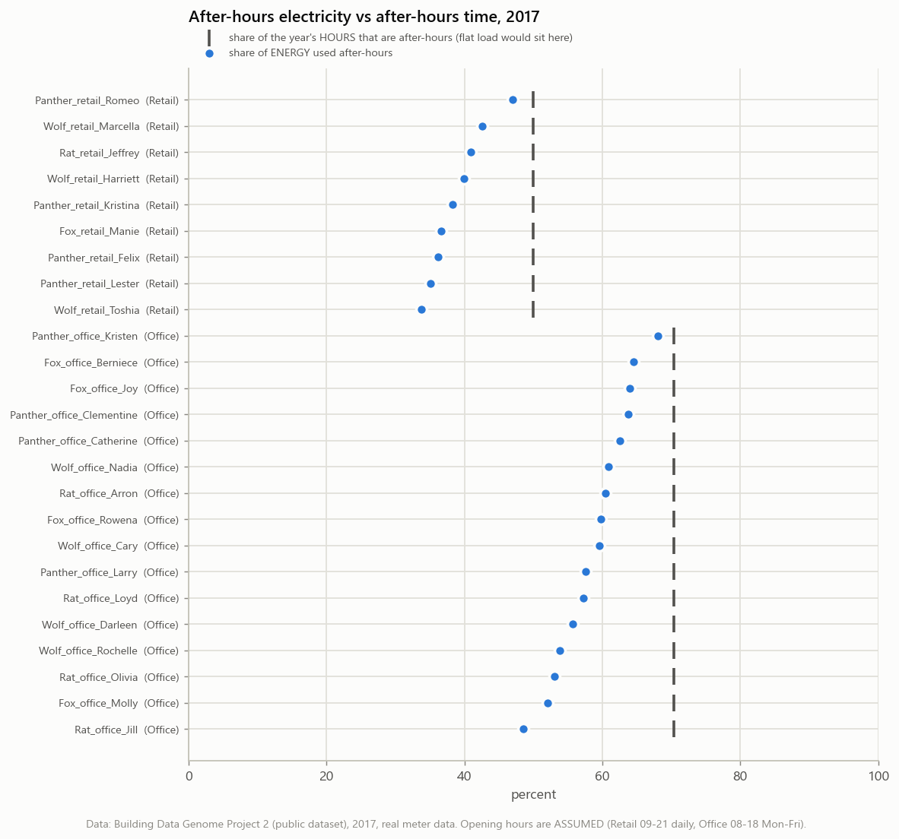

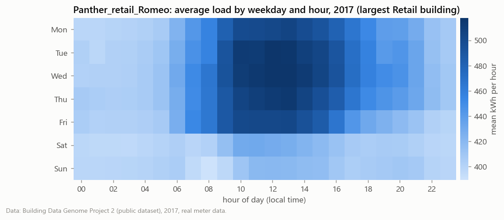

## 4. Anomalies

**There is no ground truth in this real data.** Nobody labelled which hours were faulty, so the numbers below are counts and agreement between methods, **not precision or recall**.

- Hours flagged: MAD baseline 5,996 of 218,164 scored; Isolation Forest 2,135 of 212,545 (it always flags its contamination rate, 1%).
- Daily events: MAD 906, Isolation Forest 599, weather regression 114.
- Overlap (building-days): both MAD and IF 155, MAD only 751, IF only 444, Jaccard 0.115; all three methods 25. 71 of the 266 high-severity MAD events were also flagged by IF.
- Weather model R² per building: median 0.44 (range 0.12–0.86). Temperature explains only part of daily use; schedules matter more for most buildings.

Events by severity:

| severity | isolation_forest | mad_baseline | weather_regression |
|---|---:|---:|---:|
| low | 240 | 210 | 92 |
| med | 258 | 430 | 22 |
| high | 101 | 266 | 0 |

Events by reason tag:

| reason | isolation_forest | mad_baseline | weather_regression |
|---|---:|---:|---:|
| daytime_spike | 310 | 172 | 0 |
| unexpected_low | 151 | 384 | 0 |
| after_hours_load | 133 | 344 | 0 |
| meter_dropout_suspect | 5 | 6 | 0 |
| weather_adjusted_low | 0 | 0 | 95 |
| weather_adjusted_high | 0 | 0 | 19 |

**Calibration of the MAD baseline (honest record).** The first run floored the MAD scale at 5% of each hour's expected load and flagged every hour beyond |z| 3.5. That flagged 23.6% of building-days (robust z up to 113 on a ~1.5 kW night load), which is too many to review. The final settings floor the scale at 10% of the building's mean load and need ≥ 2 consecutive flagged hours. The table below is recomputed every run and shows the trade-off; there is no 'correct' row without ground truth.

| min_scale_frac_of_building_mean | min_flag_run_hours | pct_hours_flagged | building_days_flagged | pct_building_days | chosen |
|---:|---:|---:|---:|---:|---|
| 0.05 | 1 | 4.15 | 2045 | 22.4 |  |
| 0.05 | 2 | 3.46 | 1206 | 13.2 |  |
| 0.05 | 3 | 3.05 | 906 | 9.9 |  |
| 0.1 | 1 | 3.13 | 1417 | 15.5 |  |
| 0.1 | 2 | 2.74 | 906 | 9.9 | **chosen** |
| 0.1 | 3 | 2.48 | 715 | 7.8 |  |
| 0.15 | 1 | 2.29 | 1033 | 11.3 |  |
| 0.15 | 2 | 2.02 | 683 | 7.5 |  |
| 0.15 | 3 | 1.85 | 548 | 6.0 |  |

Five example events (strongest MAD events that Isolation Forest also flagged, one per building):

| figure | building_id | date | peak_hour | reason | severity | robust_z | flagged_hours | deviation_kwh |
|---|---|---|---|---|---|---:|---:|---:|
| anomaly_example_1.png | Wolf_retail_Toshia | 2017-02-05 | 10:00 | daytime_spike | high | 20.421 | 13 | 1388.6 |
| anomaly_example_2.png | Rat_office_Jill | 2017-11-02 | 15:00 | daytime_spike | high | 19.224 | 11 | 7510.7 |
| anomaly_example_3.png | Fox_office_Molly | 2017-08-03 | 19:00 | after_hours_load | high | 18.152 | 2 | 24.3 |
| anomaly_example_4.png | Wolf_office_Rochelle | 2017-07-09 | 07:00 | after_hours_load | high | 17.132 | 15 | 298.7 |
| anomaly_example_5.png | Panther_retail_Kristina | 2017-11-10 | 13:00 | unexpected_low | high | -15.39 | 14 | -517.8 |

Manual notes on these five plots: [reports/anomaly_inspection_notes.md](reports/anomaly_inspection_notes.md).

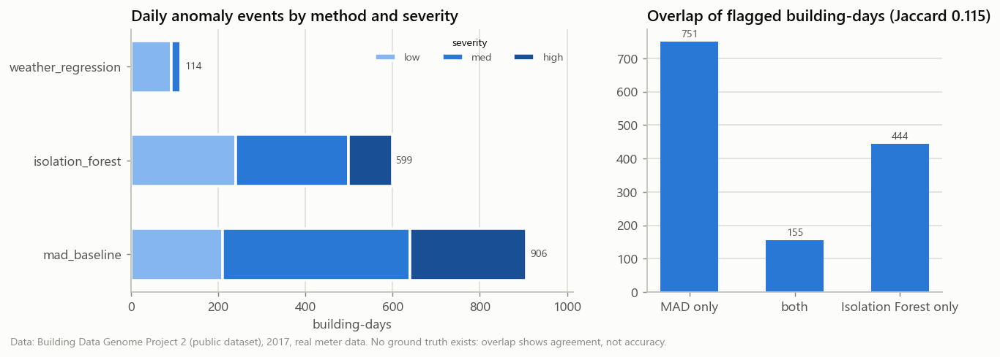

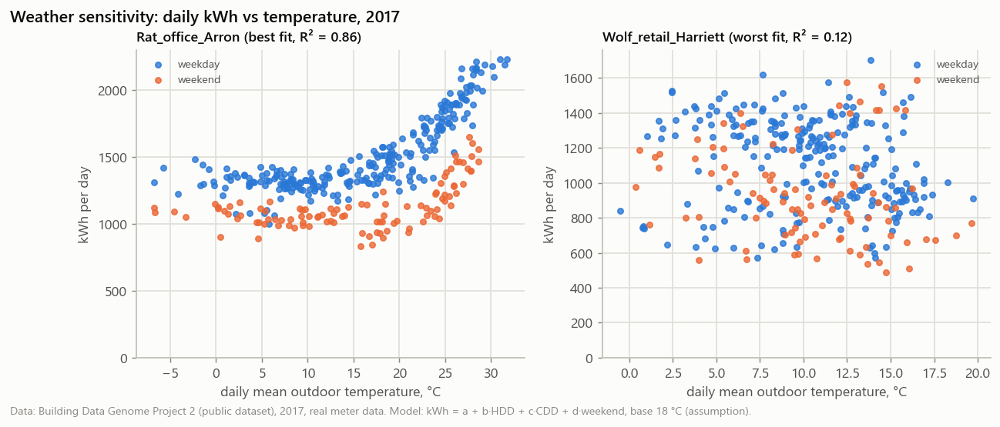

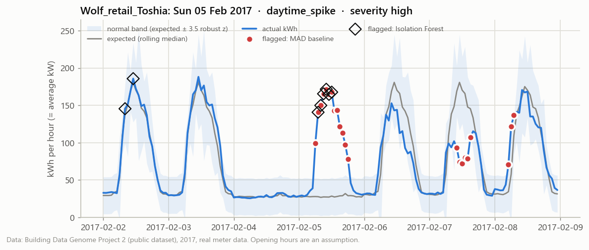
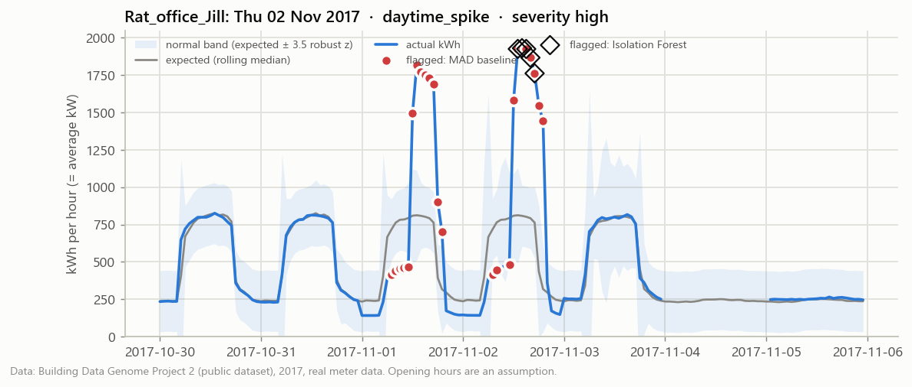
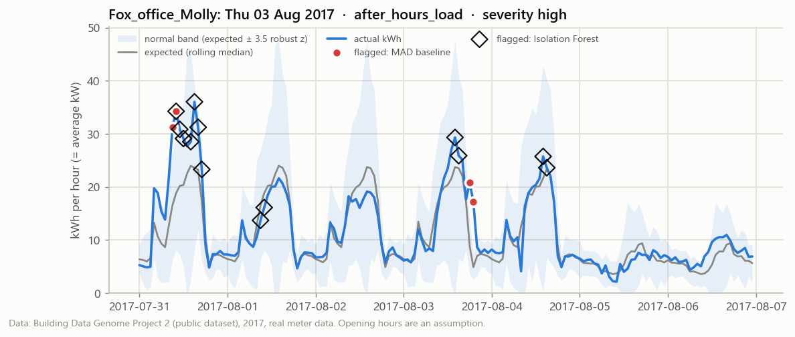
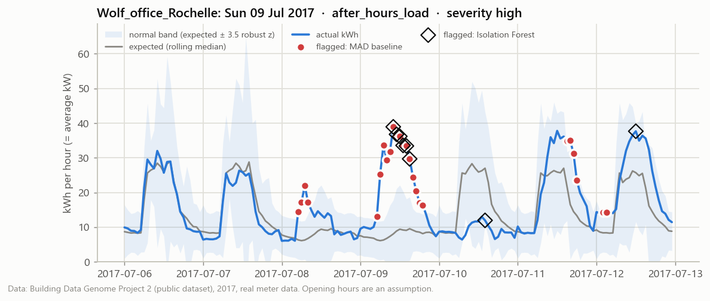
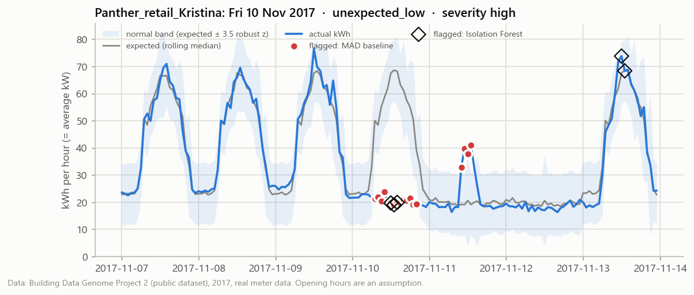

## 5. Savings opportunities (estimates)

Tariff ₹8.00/kWh and 0.675 tCO2/MWh are **assumptions** (sources in the table at the end). **The opportunity types overlap** (cutting baseload also cuts after-hours load), so they must not be added together. The after-hours excess is an **upper bound**: some after-hours load is needed (cleaning, IT, refrigeration, security).

| opportunity | scenario | buildings | kWh/yr | INR/yr (assumed tariff) | tCO2/yr (demo factor) | % of portfolio kWh |
|---|---|---:|---|---|---|---|
| after_hours_excess | upper bound | 25 | 2,342,873 | 18,742,985 | 1,581 | 11.1 |
| baseload_reduction | 10% | 25 | 1,404,165 | 11,233,317 | 948 | 6.7 |
| baseload_reduction | 15% | 25 | 2,106,247 | 16,849,975 | 1,422 | 10.0 |
| baseload_reduction | 5% | 25 | 702,082 | 5,616,658 | 474 | 3.3 |
| benchmark_gap | P75+ to P50 | 7 | 3,761,700 | 30,093,597 | 2,539 | 17.8 |

Top 10 ranked opportunities (one row per building and type; the 10% baseload scenario stands in for the three):

| rank | building | opportunity | scenario | label | kWh/yr | INR/yr | tCO2/yr | % of building |
|---:|---|---|---|---|---|---|---:|---:|
| 1 | Panther_retail_Romeo | benchmark_gap | P75+ to P50 | benchmark gap | 1,624,593 | 12,996,745 | 1096.6 | 42.4 |
| 2 | Rat_office_Jill | after_hours_excess | upper bound | upper-bound estimate | 867,641 | 6,941,129 | 585.7 | 17.0 |
| 3 | Fox_office_Joy | benchmark_gap | P75+ to P50 | benchmark gap | 593,294 | 4,746,356 | 400.5 | 38.7 |
| 4 | Panther_retail_Felix | benchmark_gap | P75+ to P50 | benchmark gap | 557,009 | 4,456,073 | 376.0 | 56.3 |
| 5 | Rat_retail_Jeffrey | benchmark_gap | P75+ to P50 | benchmark gap | 415,186 | 3,321,486 | 280.2 | 64.8 |
| 6 | Panther_retail_Romeo | baseload_reduction | 10% | what-if scenario | 343,762 | 2,750,100 | 232.0 | 9.0 |
| 7 | Wolf_office_Nadia | benchmark_gap | P75+ to P50 | benchmark gap | 266,476 | 2,131,808 | 179.9 | 40.5 |
| 8 | Rat_office_Jill | baseload_reduction | 10% | what-if scenario | 248,021 | 1,984,166 | 167.4 | 4.8 |
| 9 | Wolf_office_Cary | after_hours_excess | upper bound | upper-bound estimate | 198,287 | 1,586,293 | 133.8 | 9.4 |
| 10 | Panther_office_Larry | benchmark_gap | P75+ to P50 | benchmark gap | 169,258 | 1,354,065 | 114.2 | 40.6 |

Benchmark gaps are large because they compare buildings with different uses, climates and heating systems; treat them as a list of buildings to look at first, not as achievable savings.

## 6. Assumptions used in this run

Full text with sources: `data/processed/assumptions.csv` (generated from `config.yaml`).

| key | value | resolved_value | unit | label |
|---|---|---|---|---|
| analysis_year | auto | 2017 | calendar year | METHOD |
| primary_building_types | ["Retail"] |  | BDG2 primaryspaceusage | METHOD |
| fill_building_types | ["Office"] |  | BDG2 primaryspaceusage | METHOD |
| fill_buildings_per_site | 4 |  | buildings per site | METHOD |
| min_buildings | 15 |  | buildings | METHOD |
| max_buildings | 30 |  | buildings | METHOD |
| treat_zero_as_missing | true |  | boolean | METHOD |
| spike_multiple_of_p99 | 3.0 |  | x building's 99th percentile | METHOD |
| flatline_min_hours | 24 |  | hours | METHOD |
| max_fill_gap_hours | 3 |  | hours | METHOD |
| min_pct_valid | 95.0 |  | percent of hours | METHOD |
| max_pct_filled | 2.0 |  | percent of hours | METHOD |
| eui_plausible_min | 25 |  | kWh/m2/yr | ASSUMPTION |
| eui_plausible_max | 1000 |  | kWh/m2/yr | ASSUMPTION |
| area_tolerance_m2 | 1.0 |  | m2 | METHOD |
| weather_max_fill_gap_hours | 6 |  | hours | METHOD |
| baseload_percentile | 5 |  | percentile of a day's hourly load | METHOD |
| operating_hours | {"Retail": {"open": 9, "close": 21, "days": ["Mon", "Tue", "Wed", "Thu", "Fri", "Sat", "Sun"]}, "Office": {"open": 8, "close": 18, "days": ["Mon", "Tue", "Wed", "Thu", "Fri"]}} |  | local clock hours [open, close) | ASSUMPTION |
| operating_hours_overrides | {} |  | per-building {open, close, days} | ASSUMPTION |
| degree_day_base_c | 18.0 |  | deg C | ASSUMPTION |
| emission_factor_t_per_mwh | 0.675 |  | tCO2/MWh | ASSUMPTION |
| tariff_inr_per_kwh | 8.0 |  | INR/kWh | ASSUMPTION |
| baseline_window_obs | 15 |  | same hour-of-day and day-type observations | METHOD |
| baseline_min_obs | 5 |  | observations | METHOD |
| min_scale_frac_of_building_mean | 0.1 |  | fraction of the building's mean hourly load | METHOD |
| min_flag_run_hours | 2 |  | consecutive hours | METHOD |
| mad_z_threshold | 3.5 |  | robust z-score | METHOD |
| severity_cutoffs_z | [3.5, 5.0, 8.0] |  | robust z-score | METHOD |
| dropout_frac_of_expected | 0.1 |  | fraction of expected load | METHOD |
| if_contamination | 0.01 |  | fraction of hours | METHOD |
| if_n_estimators | 200 |  | trees | METHOD |
| if_severity_cutoffs_pct | [99.0, 99.5, 99.9] |  | percentile of building's anomaly score | METHOD |
| weather_resid_z_threshold | 3.5 |  | robust z-score of daily residual | METHOD |
| baseload_reduction_scenarios | [0.05, 0.1, 0.15] |  | fraction of baseload | ASSUMPTION |
| benchmark_from_percentile | 75 |  | percentile of EUI within peer group | ASSUMPTION |
| benchmark_target_percentile | 50 |  | percentile of EUI within peer group | ASSUMPTION |
| headline_opportunity | after_hours_excess |  | opportunity type | METHOD |
| ranking_baseload_scenario | 0.1 |  | fraction of baseload | METHOD |
| hourly_export_max_mb | 100 |  | MB | METHOD |

## 7. Limitations

- **Location mismatch:** the CEA factor and KERC tariff are Indian; the buildings are in the USA and Ireland. CO2 and INR values only demonstrate the method.
- **No ground truth for anomalies;** counts and overlap are not accuracy. The examples were inspected by eye only.
- **Assumed opening hours** drive after-hours figures and anomaly reason tags; the weekend/weekday ratio shows they are wrong for some buildings.
- **Gap filling:** gaps ≤ 3 h are linearly interpolated and flagged; longer gaps are excluded and annual totals are scaled up.
- **Electricity only:** EUI ignores gas, steam and chilled water, so total-energy comparisons are not possible.
- **Small peer groups** (9 Retail, 16 Office): percentiles move a lot if one building changes.
- **One year (2017), hourly resolution:** no year-on-year comparison, and peaks shorter than an hour are invisible.
